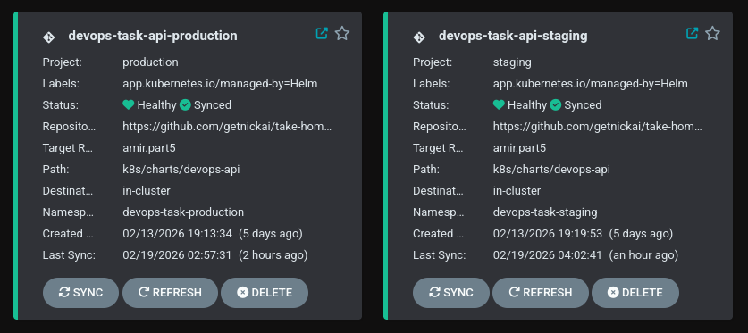

## Tooling Choice
ArgoCD has secured it's standing as a de facto industry standard tool with it's simplicity.  At the same time it has numerous features, supports plugins and is easily scalable.  Helm Charts are used to template Kubernetes resources of the application - this will enabled usage of the same source both in live and development environments.

## Secret management
Currently secrets used to access PostgreSQL database are generated and consumed within the same cluster, thus there is no need of a secret manager.  External Secrets Operator can easiliy be integrated to secure delivery of the secrets to the runtime environments upon demand.

## Environments & Promotion
There are two live environments: `production` and `staging` which are isolated in different Kubernetes namespaces and use different configurations:

* [Production Configuration](../k8s/charts/devops-api/values-production.yaml)
* [Staging Configuration](../k8s/charts/devops-api/values-staging.yaml)

Staging environment should receive updates on every update on `main` branch while the Production environment will follow only updates tagged with semantic versions.
