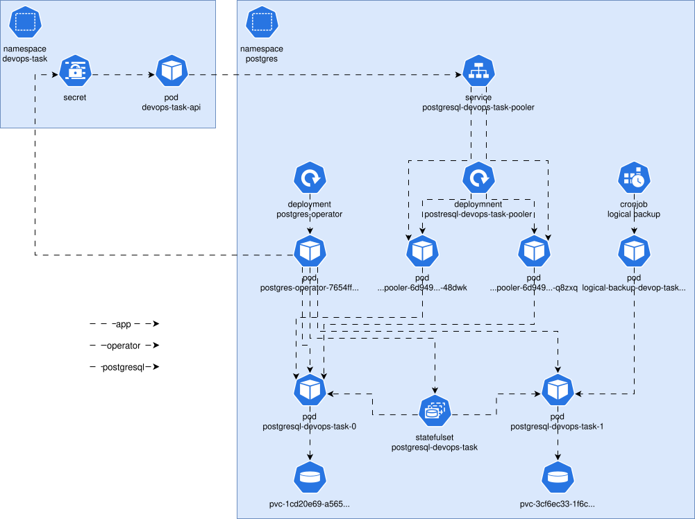

## Tooling Choice
Zalando Postgres Operator is a simple yet a very flexible sufficient for the use case.



## Setup
Terraform is used to setup the PostgreSQL Operator and the cluster itself.

## Connection Pool

A pooler deployment is enabled to proxy connections between instances.  Apps should use the pooler service endpoint as a PostgreSQL endpoint.

```
postgres://postgresql-devops-task-pooler:5432/devops_task?sslmode=require
```

```yaml
connectionPooler:
  numberOfInstances: 2
  mode: "transaction"
  schema: "pooler"
  user: "pooler"
  maxDBConnections: 60
  resources:
    requests:
      cpu: 250m
      memory: 100Mi
    limits:
      cpu: 500m
      memory: 200Mi
```

## Backup

Both logical and wal backups are conducted on daily bases.

```yaml
logicalBackupSchedule: 30 00 * * *
logicalBackupRetention: "15 days"
maintenanceWindows:
  - 02:00-05:00
```

```yaml
BACKUP_SCHEDULE: 20 00 * * *
BACKUP_NUM_TO_RETAIN: 15
```

## Disaster Recovery

###Clone from S3

Cloning from S3 has the advantage that there is no impact on your production database.  A new Postgres cluster is created by restoring the data of another source cluster.  If you create it in the same Kubernetes environment, use a different name.

```yaml
apiVersion: "acid.zalan.do/v1"
kind: postgresql
metadata:
  name: postgresql-devops-task-clone
spec:
  clone:
    uid: "efd12e58-5786-11e8-b5a7-06148230260c"
    cluster: "postgresql-devops-task"
    timestamp: "2022-12-19T12:40:33+01:00"
```

Here `cluster` is a name of a source cluster that is going to be cloned.  A new cluster will be cloned from S3, using the latest backup before the timestamp.  Note, a time zone is required for timestamp in the format of +00:00 (UTC).

The operator will try to find the WAL location based on the configured `wal_s3_bucket` and the specified `uid`.

There is also a possibility to restore a database without cloning it.  The advantage to this is that there is no need to change anything on the application side.  However, as it involves deleting the database first, this process is of course riskier than cloning (which involves adjusting the connection parameters of the app).

First, make sure there is no writing activity on your DB, and save the UID.  Then delete the postgresql K8S resource:

```bash
kubectl delete postgresql acid-test-restore
```

Then deploy a new manifest with the same name, referring to itself (both name and UID) in the clone section:

```yaml
metadata:
  name: acid-minimal-cluster
  ...
spec:
  ...
  clone:
    cluster: "acid-minimal-cluster"  # the same as metadata.name above!
    uid: "<original_UID>"
    timestamp: "2025-04-01T10:11:12.000+00:00"
```

This will create a new database cluster with the same name but different UID, whereas the database will be in the state it was at the specified time.

### Switchover & Failover

When running a PostgreSQL cluster one might need to change the leader of the cluster for maintenance.  In case of Zalando Postgres Operator this is handled by Patroni directly inside the cluster pods.

```bash
# patronictl list
+ Cluster: postgresql-devops-task (7604881370934526023) -------+----+-----------+
| Member                   | Host        | Role    | State     | TL | Lag in MB |
+--------------------------+-------------+---------+-----------+----+-----------+
| postgresql-devops-task-0 | 10.0.18.122 | Replica | streaming |  2 |         0 |
| postgresql-devops-task-1 | 10.0.27.10  | Leader  | running   |  2 |           |
+--------------------------+-------------+---------+-----------+----+-----------+
```

There are two possibilities to run a switchover, either in scheduled mode or immediately.

```bash
# patronictl switchover postgresql-devops-task
Current cluster topology
+ Cluster: postgresql-devops-task (7604881370934526023) -------+----+-----------+
| Member                   | Host        | Role    | State     | TL | Lag in MB |
+--------------------------+-------------+---------+-----------+----+-----------+
| postgresql-devops-task-0 | 10.0.18.122 | Replica | streaming |  2 |         0 |
| postgresql-devops-task-1 | 10.0.27.10  | Leader  | running   |  2 |           |
+--------------------------+-------------+---------+-----------+----+-----------+
Primary [postgresql-devops-task-1]:
Candidate ['postgresql-devops-task-0'] []:
When should the switchover take place (e.g. 2026-02-10T16:54 )  [now]:
Are you sure you want to switchover cluster postgresql-devops-task, demoting current leader postgresql-devops-task-1? [y/N]: y
2026-02-10 15:54:34.55283 Successfully switched over to "postgresql-devops-task-0"
+ Cluster: postgresql-devops-task (7604881370934526023) ------+----+-----------+
| Member                   | Host        | Role    | State    | TL | Lag in MB |
+--------------------------+-------------+---------+----------+----+-----------+
| postgresql-devops-task-0 | 10.0.18.122 | Leader  | running  |  2 |           |
| postgresql-devops-task-1 | 10.0.27.10  | Replica | stopping |    |   unknown |
+--------------------------+-------------+---------+----------+----+-----------+
```

In difference to the switchover, the failover is executed automatically, when the Leader node is getting unavailable for unplanned reason.